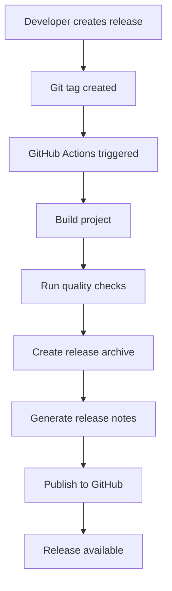

# GitHub Releases Guide / Керівництво GitHub релізів

## 🇺🇸 English

### Overview / Огляд

This guide explains how to set up and use GitHub Releases for the vite-landing-template project. GitHub Releases provide a way to package and deliver software to users with release notes, downloadable assets, and version management.

### Prerequisites / Передумови

- ✅ **GitHub repository** / GitHub репозиторій
- ✅ **GitHub Actions enabled** / GitHub Actions увімкнено
- ✅ **Proper git tags** / Правильні git теги
- ✅ **CHANGELOG.md** with version entries / CHANGELOG.md з записами версій

### Setup Process / Процес налаштування

#### 1. **GitHub Actions Workflow** / GitHub Actions робочий процес

The project includes an automated GitHub Actions workflow that:

Проект включає автоматизований GitHub Actions робочий процес, який:

- ✅ **Triggers on version tags** / Тригери на теги версій (`v*`)
- ✅ **Builds the project** / Збирає проект
- ✅ **Runs quality checks** / Запускає перевірки якості
- ✅ **Creates release archive** / Створює архів релізу
- ✅ **Generates release notes** / Генерує примітки релізу
- ✅ **Publishes to GitHub** / Публікує на GitHub

#### 2. **Release Script** / Скрипт релізу

Enhanced release script with GitHub integration:

Покращений скрипт релізу з інтеграцією GitHub:

```bash
# Create GitHub release / Створити GitHub реліз
node scripts/github-release.js minor "feat: add new feature"
```

### Creating Releases / Створення релізів

#### Method 1: Using Release Script / Метод 1: Використання скрипта релізу

```bash
# Patch release (bug fixes) / Patch реліз (виправлення помилок)
node scripts/github-release.js patch "fix: critical bug fix"

# Minor release (new features) / Minor реліз (нові функції)
node scripts/github-release.js minor "feat: add WebP optimization"

# Major release (breaking changes) / Major реліз (критичні зміни)
node scripts/github-release.js major "feat: breaking API changes"

# Custom version / Користувацька версія
node scripts/github-release.js 1.0.0 "feat: first stable release"
```

#### Method 2: Manual GitHub Release / Метод 2: Ручний GitHub реліз

1. **Create git tag** / Створити git тег:
   ```bash
   git tag -a v0.9.1 -m "Release v0.9.1"
   git push origin v0.9.1
   ```

2. **GitHub Actions will automatically** / GitHub Actions автоматично:
   - Build the project / Збере проект
   - Create release archive / Створить архів релізу
   - Generate release notes / Згенерує примітки релізу
   - Publish to GitHub / Опублікує на GitHub

### Release Workflow / Робочий процес релізу

#### Step-by-Step Process / Поетапний процес



#### Detailed Steps / Детальні кроки

1. **Tag Creation** / Створення тегу:
   ```bash
   git tag -a v0.9.1 -m "Release v0.9.1"
   ```

2. **Push to GitHub** / Відправка на GitHub:
   ```bash
   git push origin main
   git push origin v0.9.1
   ```

3. **GitHub Actions Execution** / Виконання GitHub Actions:
   - Checkout code / Перевірка коду
   - Setup Node.js / Налаштування Node.js
   - Install dependencies / Встановлення залежностей
   - Run linting / Запуск лінтингу
   - Build project / Збірка проекту
   - Create release archive / Створення архіву релізу
   - Generate release notes / Генерація приміток релізу
   - Create GitHub release / Створення GitHub релізу

### Release Content / Зміст релізу

#### What's Included / Що включено

Each GitHub release includes:

Кожен GitHub реліз включає:

- ✅ **Release notes** / Примітки релізу (from CHANGELOG.md)
- ✅ **Downloadable archive** / Завантажуваний архів
- ✅ **Version tag** / Тег версії
- ✅ **Build artifacts** / Артефакти збірки

#### Archive Contents / Зміст архіву

The release archive contains:

Архів релізу містить:

```
vite-landing-template-v0.9.0.tar.gz
├── dist/              # Built files / Зібрані файли
├── docs/              # Documentation / Документація
├── README.md          # Project readme / Проект readme
├── LICENSE            # License file / Файл ліцензії
└── package.json       # Package configuration / Конфігурація пакету
```

### Release Notes Generation / Генерація приміток релізу

#### Automatic Generation / Автоматична генерація

Release notes are automatically generated from:

Примітки релізу автоматично генеруються з:

- ✅ **CHANGELOG.md entries** / Записів CHANGELOG.md
- ✅ **Version-specific changes** / Змін конкретної версії
- ✅ **Installation instructions** / Інструкцій встановлення

#### Manual Customization / Ручна кастомізація

You can customize release notes by:

Ви можете кастомізувати примітки релізу:

1. **Editing CHANGELOG.md** / Редагування CHANGELOG.md
2. **Modifying workflow** / Модифікація робочого процесу
3. **Using GitHub web interface** / Використання веб-інтерфейсу GitHub

### Best Practices / Найкращі практики

#### Version Naming / Найменування версій

- ✅ **Use semantic versioning** / Використовуйте семантичне версіонування
- ✅ **Pre-release versions** / Версії pre-release: `0.x.x`
- ✅ **Stable versions** / Стабільні версії: `1.x.x`
- ✅ **Consistent tagging** / Послідовне тегування: `v0.9.0`

#### Release Frequency / Частота релізів

- ✅ **Patch releases** / Patch релізи: Weekly / Щотижня
- ✅ **Minor releases** / Minor релізи: Bi-weekly / Раз на два тижні
- ✅ **Major releases** / Major релізи: Monthly / Щомісяця

#### Quality Assurance / Забезпечення якості

- ✅ **Always test before release** / Завжди тестуйте перед релізом
- ✅ **Run full test suite** / Запускайте повний набір тестів
- ✅ **Check build output** / Перевіряйте результат збірки
- ✅ **Validate release notes** / Валідуйте примітки релізу

### Troubleshooting / Вирішення проблем

#### Common Issues / Типові проблеми

##### 1. **GitHub Actions Fails** / GitHub Actions не вдається

```bash
# Check workflow logs / Перевірте логи робочого процесу
# Go to: Actions tab in GitHub / Перейдіть: вкладка Actions в GitHub
```

##### 2. **Release Not Created** / Реліз не створено

```bash
# Check tag format / Перевірте формат тегу
git tag -l  # Should show v* tags / Повинно показувати v* теги
```

##### 3. **Archive Upload Fails** / Завантаження архіву не вдається

```bash
# Check file size limits / Перевірте ліміти розміру файлу
# GitHub limit: 2GB / Ліміт GitHub: 2GB
```

#### Debug Commands / Команди налагодження

```bash
# Check GitHub Actions status / Перевірте статус GitHub Actions
gh run list

# View workflow logs / Переглянути логи робочого процесу
gh run view <run-id>

# Check repository settings / Перевірити налаштування репозиторію
gh repo view
```

### Integration with CI/CD / Інтеграція з CI/CD

#### Automated Deployment / Автоматизований деплой

GitHub Releases can be integrated with:

GitHub релізи можна інтегрувати з:

- ✅ **Netlify** - Automatic deployment / Автоматичний деплой
- ✅ **Vercel** - Preview deployments / Деплой попереднього перегляду
- ✅ **GitHub Pages** - Static site hosting / Хостинг статичних сайтів
- ✅ **CDN** - Asset distribution / Розповсюдження ресурсів

#### Example Integration / Приклад інтеграції

```yaml
# .github/workflows/deploy.yml
name: Deploy to Netlify

on:
  release:
    types: [published]

jobs:
  deploy:
    runs-on: ubuntu-latest
    steps:
      - name: Deploy to Netlify
        uses: nwtgck/actions-netlify@v2.0
        with:
          publish-dir: './dist'
          production-branch: main
```

### Monitoring and Analytics / Моніторинг та аналітика

#### Release Metrics / Метрики релізу

Track release success with:

Відстежуйте успіх релізу з:

- ✅ **Download counts** / Кількість завантажень
- ✅ **Release views** / Перегляди релізу
- ✅ **User feedback** / Відгуки користувачів
- ✅ **Issue reports** / Звіти про проблеми

#### GitHub Insights / GitHub Insights

Use GitHub's built-in analytics:

Використовуйте вбудовану аналітику GitHub:

- ✅ **Repository insights** / Інсайти репозиторію
- ✅ **Release analytics** / Аналітика релізів
- ✅ **Download statistics** / Статистика завантажень
- ✅ **User engagement** / Взаємодія користувачів

## 🇺🇦 Українська

### Огляд

Це керівництво пояснює, як налаштувати та використовувати GitHub релізи для проекту vite-landing-template. GitHub релізи надають спосіб упаковки та доставки програмного забезпечення користувачам з примітками релізу, завантажуваними ресурсами та управлінням версіями.

### Передумови

- ✅ **GitHub репозиторій**
- ✅ **GitHub Actions увімкнено**
- ✅ **Правильні git теги**
- ✅ **CHANGELOG.md** з записами версій

### Процес налаштування

#### 1. **GitHub Actions робочий процес**

Проект включає автоматизований GitHub Actions робочий процес, який:

- ✅ **Тригери на теги версій** (`v*`)
- ✅ **Збирає проект**
- ✅ **Запускає перевірки якості**
- ✅ **Створює архів релізу**
- ✅ **Генерує примітки релізу**
- ✅ **Публікує на GitHub**

#### 2. **Скрипт релізу**

Покращений скрипт релізу з інтеграцією GitHub:

```bash
# Створити GitHub реліз
node scripts/github-release.js minor "feat: додано нову функцію"
```

### Створення релізів

#### Метод 1: Використання скрипта релізу

```bash
# Patch реліз (виправлення помилок)
node scripts/github-release.js patch "fix: критична помилка"

# Minor реліз (нові функції)
node scripts/github-release.js minor "feat: додано оптимізацію WebP"

# Major реліз (критичні зміни)
node scripts/github-release.js major "feat: критичні зміни API"

# Користувацька версія
node scripts/github-release.js 1.0.0 "feat: перший стабільний реліз"
```

#### Метод 2: Ручний GitHub реліз

1. **Створити git тег**:
   ```bash
   git tag -a v0.9.1 -m "Release v0.9.1"
   git push origin v0.9.1
   ```

2. **GitHub Actions автоматично**:
   - Збере проект
   - Створить архів релізу
   - Згенерує примітки релізу
   - Опублікує на GitHub

### Робочий процес релізу

#### Поетапний процес

1. **Створення тегу**:
   ```bash
   git tag -a v0.9.1 -m "Release v0.9.1"
   ```

2. **Відправка на GitHub**:
   ```bash
   git push origin main
   git push origin v0.9.1
   ```

3. **Виконання GitHub Actions**:
   - Перевірка коду
   - Налаштування Node.js
   - Встановлення залежностей
   - Запуск лінтингу
   - Збірка проекту
   - Створення архіву релізу
   - Генерація приміток релізу
   - Створення GitHub релізу

### Зміст релізу

#### Що включено

Кожен GitHub реліз включає:

- ✅ **Примітки релізу** (з CHANGELOG.md)
- ✅ **Завантажуваний архів**
- ✅ **Тег версії**
- ✅ **Артефакти збірки**

#### Зміст архіву

Архів релізу містить:

```
vite-landing-template-v0.9.0.tar.gz
├── dist/              # Зібрані файли
├── docs/              # Документація
├── README.md          # Проект readme
├── LICENSE            # Файл ліцензії
└── package.json       # Конфігурація пакету
```

### Генерація приміток релізу

#### Автоматична генерація

Примітки релізу автоматично генеруються з:

- ✅ **Записів CHANGELOG.md**
- ✅ **Змін конкретної версії**
- ✅ **Інструкцій встановлення**

#### Ручна кастомізація

Ви можете кастомізувати примітки релізу:

1. **Редагування CHANGELOG.md**
2. **Модифікація робочого процесу**
3. **Використання веб-інтерфейсу GitHub**

### Найкращі практики

#### Найменування версій

- ✅ **Використовуйте семантичне версіонування**
- ✅ **Версії pre-release**: `0.x.x`
- ✅ **Стабільні версії**: `1.x.x`
- ✅ **Послідовне тегування**: `v0.9.0`

#### Частота релізів

- ✅ **Patch релізи**: Щотижня
- ✅ **Minor релізи**: Раз на два тижні
- ✅ **Major релізи**: Щомісяця

#### Забезпечення якості

- ✅ **Завжди тестуйте перед релізом**
- ✅ **Запускайте повний набір тестів**
- ✅ **Перевіряйте результат збірки**
- ✅ **Валідуйте примітки релізу**

### Вирішення проблем

#### Типові проблеми

##### 1. **GitHub Actions не вдається**

```bash
# Перевірте логи робочого процесу
# Перейдіть: вкладка Actions в GitHub
```

##### 2. **Реліз не створено**

```bash
# Перевірте формат тегу
git tag -l  # Повинно показувати v* теги
```

##### 3. **Завантаження архіву не вдається**

```bash
# Перевірте ліміти розміру файлу
# Ліміт GitHub: 2GB
```

#### Команди налагодження

```bash
# Перевірте статус GitHub Actions
gh run list

# Переглянути логи робочого процесу
gh run view <run-id>

# Перевірити налаштування репозиторію
gh repo view
```

### Інтеграція з CI/CD

#### Автоматизований деплой

GitHub релізи можна інтегрувати з:

- ✅ **Netlify** - Автоматичний деплой
- ✅ **Vercel** - Деплой попереднього перегляду
- ✅ **GitHub Pages** - Хостинг статичних сайтів
- ✅ **CDN** - Розповсюдження ресурсів

### Моніторинг та аналітика

#### Метрики релізу

Відстежуйте успіх релізу з:

- ✅ **Кількість завантажень**
- ✅ **Перегляди релізу**
- ✅ **Відгуки користувачів**
- ✅ **Звіти про проблеми**

#### GitHub Insights

Використовуйте вбудовану аналітику GitHub:

- ✅ **Інсайти репозиторію**
- ✅ **Аналітика релізів**
- ✅ **Статистика завантажень**
- ✅ **Взаємодія користувачів**

---

## 📚 Related Documentation / Пов'язана документація

- [Release Guide](RELEASE.md) - Release management / Управління релізами
- [Development Guide](DEVELOPMENT.md) - Development workflow / Робочий процес розробки
- [Deployment Guide](DEPLOYMENT.md) - Deployment instructions / Інструкції деплою
- [CHANGELOG.md](../../CHANGELOG.md) - Project changelog / Журнал змін проекту
